```r
#install.packages("animint2")#from CRAN (stable).
##OR from GitHub (development).
#if(!require("remotes"))install.packages("remotes")
#remotes:install_github("tdhock/animint2")
#install.packages("remote")
```


```r
library(animint2)
library(tidyverse)
library(janitor)
library(here)
library(ggmap)
library(albersusa)
library(skimr)
```


```r
data(WorldBank, package="animint2")
tail (WorldBank)
```

```
##       iso2c  country year fertility.rate life.expectancy population
## 13033    ZW Zimbabwe 2007          3.491        45.79707   12740160
## 13034    ZW Zimbabwe 2008          3.428        47.07061   12784041
## 13035    ZW Zimbabwe 2009          3.360        48.45049   12888918
## 13036    ZW Zimbabwe 2010          3.290        49.86088   13076978
## 13037    ZW Zimbabwe 2011          3.219        51.23644   13358738
## 13038    ZW Zimbabwe 2012             NA              NA   13724317
##       GDP.per.capita.Current.USD 15.to.25.yr.female.literacy iso3c
## 13033                   415.3755                          NA   ZWE
## 13034                   345.4074                          NA   ZWE
## 13035                   475.8538                          NA   ZWE
## 13036                   568.4275                    99.55316   ZWE
## 13037                   722.8377                          NA   ZWE
## 13038                   787.9382                          NA   ZWE
##                                       region capital longitude latitude
## 13033 Sub-Saharan Africa (all income levels)  Harare   31.0672 -17.8312
## 13034 Sub-Saharan Africa (all income levels)  Harare   31.0672 -17.8312
## 13035 Sub-Saharan Africa (all income levels)  Harare   31.0672 -17.8312
## 13036 Sub-Saharan Africa (all income levels)  Harare   31.0672 -17.8312
## 13037 Sub-Saharan Africa (all income levels)  Harare   31.0672 -17.8312
## 13038 Sub-Saharan Africa (all income levels)  Harare   31.0672 -17.8312
##           income lending
## 13033 Low income   Blend
## 13034 Low income   Blend
## 13035 Low income   Blend
## 13036 Low income   Blend
## 13037 Low income   Blend
## 13038 Low income   Blend
```


```r
WorldBank1975 <- subset(WorldBank, year==1975)
head(WorldBank1975)
```

```
##     iso2c              country year fertility.rate life.expectancy population
## 281    AD              Andorra 1975             NA              NA      30706
## 334    AE United Arab Emirates 1975          6.009        66.18539     532742
## 387    AF          Afghanistan 1975          7.692        37.25712   12551790
## 440    AG  Antigua and Barbuda 1975             NA              NA      69253
## 493    AL              Albania 1975          4.417        68.32583    2426592
## 546    AM              Armenia 1975          2.745        70.52751    2825650
##     GDP.per.capita.Current.USD 15.to.25.yr.female.literacy iso3c
## 281                  7168.3987                          NA   AND
## 334                 27631.8985                    56.27697   ARE
## 387                   188.5521                          NA   AFG
## 440                         NA                          NA   ATG
## 493                         NA                          NA   ALB
## 546                         NA                          NA   ARM
##                                             region          capital longitude
## 281      Europe & Central Asia (all income levels) Andorra la Vella    1.5218
## 334 Middle East & North Africa (all income levels)        Abu Dhabi   54.3705
## 387                                     South Asia            Kabul   69.1761
## 440  Latin America & Caribbean (all income levels)     Saint John's  -61.8456
## 493      Europe & Central Asia (all income levels)           Tirane   19.8172
## 546      Europe & Central Asia (all income levels)          Yerevan    44.509
##     latitude               income        lending
## 281  42.5075 High income: nonOECD Not classified
## 334  24.4764 High income: nonOECD Not classified
## 387  34.5228           Low income            IDA
## 440  17.1175  Upper middle income           IBRD
## 493  41.3317  Upper middle income           IBRD
## 546  40.1596  Lower middle income          Blend
```


```r
scatter1 <- ggplot()+
  geom_point(
    mapping=aes(x=life.expectancy, y=fertility.rate, color=region),
    data=WorldBank1975)
scatter1
```

```
## Warning: Removed 27 rows containing missing values (geom_point).
```

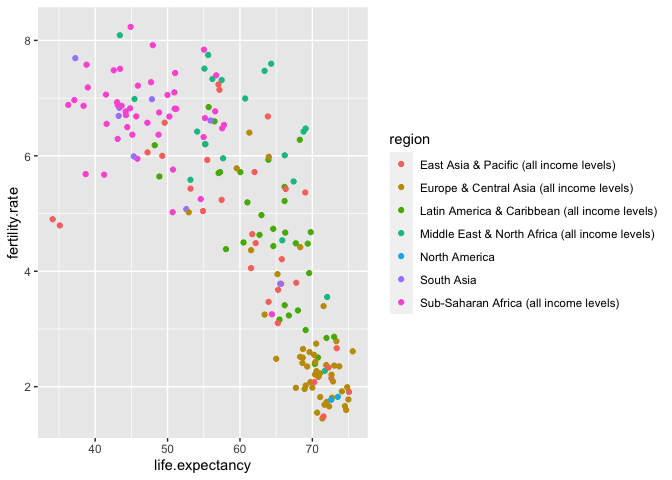<!-- -->

```r
# animint2gist(animint(scatter1))  # Creates bl.ocks.org visual to display scatter1. 
```


```r
WorldBankBefore1975 <- subset(WorldBank, 1970 <= year & year <= 1975)
two.layers <- scatter1+
  geom_path(aes(x=life.expectancy, y=fertility.rate, color=region,
                group=country),
            data=WorldBankBefore1975)

two.layers
```

```
## Warning: Removed 27 rows containing missing values (geom_point).
```

```
## Warning: Removed 162 rows containing missing values (geom_path).
```

<!-- -->

```r
#(viz.two.layers <- animint(two.layers))
#animint2gist(viz.two.layers)
```


## Exercise: Switch fertility.rate and life.expectancy. 
This requires us to create a different scatter plot, which we'll name scatterswitched.

```r
scatterswitched <- ggplot()+
  geom_point(
    mapping=aes(x=fertility.rate, y=life.expectancy, color=region),
    data=WorldBank1975)
scatterswitched
```

```
## Warning: Removed 27 rows containing missing values (geom_point).
```

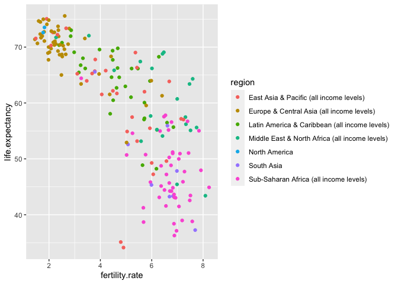<!-- -->

```r
# animint2gist(animint(scatterswitched))  # Creates bl.ocks.org visual to display scatterswitched.
```

## Exercise continued: Here is the flipped scatterplot. 


```r
WorldBankBefore1975 <- subset(WorldBank, 1970 <= year & year <= 1975)
two.layers.switched <- scatterswitched+
  geom_path(aes(x=fertility.rate, y=life.expectancy, color=region,
                group=country),
            data=WorldBankBefore1975)

two.layers.switched
```

```
## Warning: Removed 27 rows containing missing values (geom_point).
```

```
## Warning: Removed 162 rows containing missing values (geom_path).
```

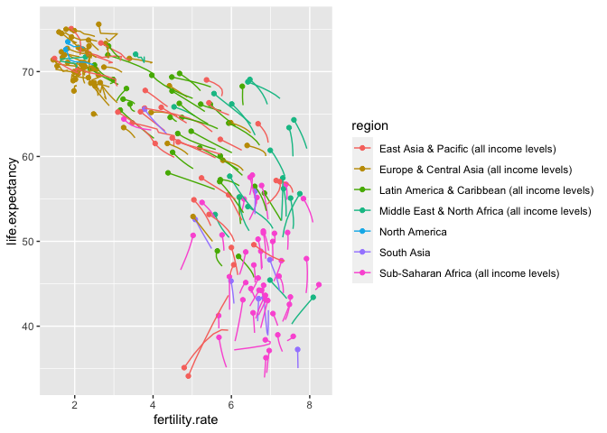<!-- -->

```r
#(viz.two.layers.switched <- animint(two.layers.switched))
#animint2gist(viz.two.layers.switched)
```


```r
three.layers <- two.layers+
  geom_text(aes(x=life.expectancy, y=fertility.rate, color=region,
                label=country),
            data=WorldBank1975)

three.layers
```

```
## Warning: Removed 27 rows containing missing values (geom_point).
```

```
## Warning: Removed 162 rows containing missing values (geom_path).
```

```
## Warning: Removed 27 rows containing missing values (geom_text).
```

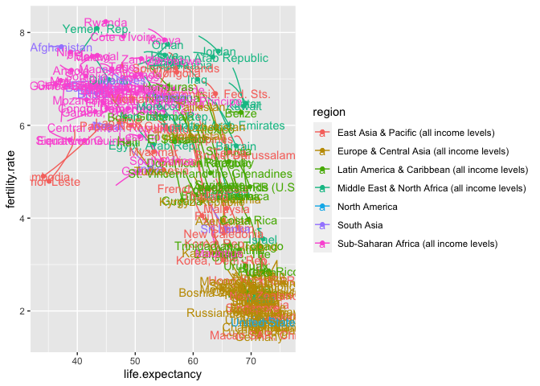<!-- -->


```r
two.layersstorage <- two.layers
two.layers$timeSeries <- ggplot()+
  geom_line(aes(x=year, y=fertility.rate, color=region, group=country),
            data=WorldBank)

two.layersstorage
```

```
## Warning: Removed 27 rows containing missing values (geom_point).
```

```
## Warning: Removed 162 rows containing missing values (geom_path).
```

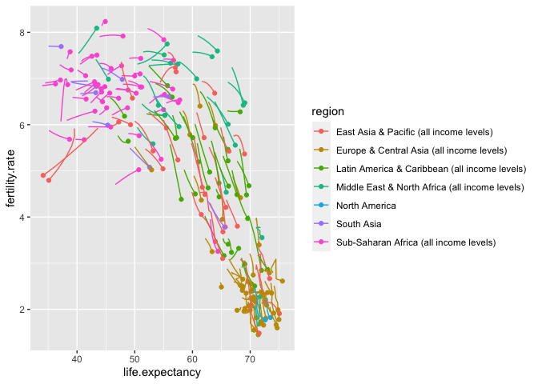<!-- -->

```r
two.layers$timeSeries
```

```
## Warning: Removed 1183 rows containing missing values (geom_path).
```

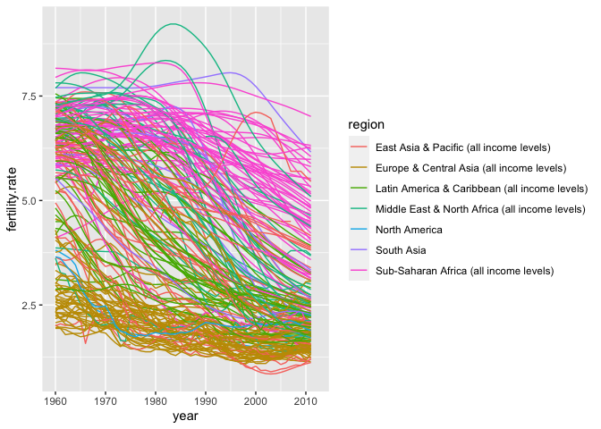<!-- -->


```r
add.x.var <- function(df, x.var){
  data.frame(df, x.var=factor(x.var, c("life expectancy", "year")))
}

  scatterfirst=ggplot()+
    geom_point(aes(x=life.expectancy, y=fertility.rate, color=region),
               data=add.x.var(WorldBank1975, "life expectancy"))+
    geom_path(aes(x=life.expectancy, y=fertility.rate, color=region,
                  group=country),
              data=add.x.var(WorldBankBefore1975, "life expectancy"))+
    geom_line(aes(x=year, y=fertility.rate, color=region, group=country),
              data=add.x.var(WorldBank, "year"))+theme(axis.text.x = element_text(angle = 50, hjust = 1))+
    xlab("")+
    facet_grid(. ~ x.var, scales="free")+
    theme_bw()+
    theme(panel.margin=grid::unit(0, "lines"))
```

```
## Warning: `panel.margin` is deprecated. Please use `panel.spacing` property
## instead
```

```r
  scatterfirst
```

```
## Warning: Removed 27 rows containing missing values (geom_point).
```

```
## Warning: Removed 162 rows containing missing values (geom_path).
```

```
## Warning: Removed 1183 rows containing missing values (geom_path).
```

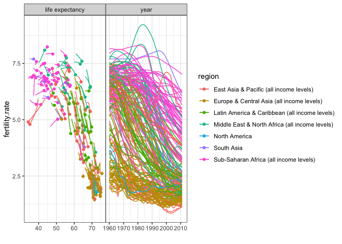<!-- -->

```r
  #animint(scatterfirst)
```


```r
show.point.list <- list()
show.path.list <- list()
for(show.year in c(1975, 1985, 1995)){
  show.point.list[[paste(show.year)]] <- data.frame(
    show.year, subset(WorldBank, year==show.year))
  show.path.list[[paste(show.year)]] <- data.frame(
    show.year, subset(WorldBank, show.year - 5 <= year & year <= show.year))
}
show.point <- do.call(rbind, show.point.list)
show.path <- do.call(rbind, show.path.list)
```


```r
threepanelsvisual <- list(
  scatter=ggplot()+
    geom_point(aes(x=life.expectancy, y=fertility.rate, color=region),
               data=show.point)+
    geom_path(aes(x=life.expectancy, y=fertility.rate, color=region,
                  group=country),
              data=show.path)+
    facet_grid(. ~ show.year)+
    theme_bw()+
    theme(panel.margin=grid::unit(0, "lines"))
  )
```

```
## Warning: `panel.margin` is deprecated. Please use `panel.spacing` property
## instead
```

```r
threepanelsvisual
```

```
## $scatter
```

```
## Warning: Removed 76 rows containing missing values (geom_point).
```

```
## Warning: Removed 422 rows containing missing values (geom_path).
```

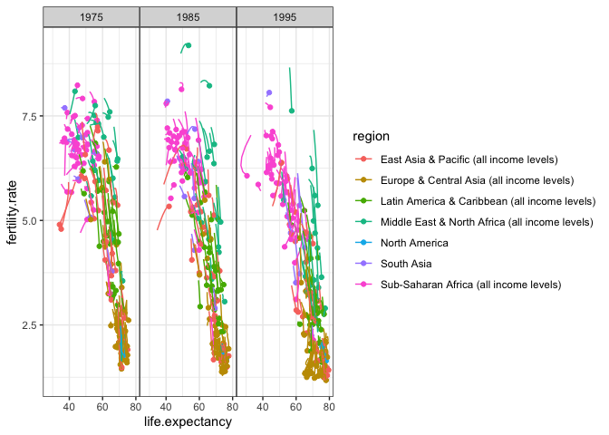<!-- -->

## More Exercises

Visualize a different type of data not present in the animint2 Manual. 

Data Source: https://rcweb.dartmouth.edu/~f002d69/workshops/index_rspatial.html which represents sightings of grizzly bears (Ursos arctos) in Alaska. 

Other data set used is from Brandell, Ellen E (2021), Serological dataset and R code for: Patterns and processes of pathogen exposure in gray wolves across North America, Dryad, (https://doi.org/10.5061/dryad.5hqbzkh51).  

Load the `grizzly` data and evaluate its structure. 

```r
grizzly <- read_csv(here("data", "bear-sightings.csv")) 
```

```
## Parsed with column specification:
## cols(
##   bear.id = col_double(),
##   longitude = col_double(),
##   latitude = col_double()
## )
```

```r
grizzly <- janitor::clean_names(grizzly)
grizzly
```

```
## # A tibble: 494 x 3
##    bear_id longitude latitude
##      <dbl>     <dbl>    <dbl>
##  1       7     -149.     62.7
##  2      57     -153.     58.4
##  3      69     -145.     62.4
##  4      75     -153.     59.9
##  5     104     -143.     61.1
##  6     108     -150.     62.9
##  7     115     -152.     68.0
##  8     116     -147.     62.6
##  9     125     -157.     60.2
## 10     135     -156.     58.9
## # … with 484 more rows
```


```r
glimpse(grizzly)
```

```
## Rows: 494
## Columns: 3
## $ bear_id   <dbl> 7, 57, 69, 75, 104, 108, 115, 116, 125, 135, 137, 162, 185,…
## $ longitude <dbl> -148.9560, -152.6228, -144.9374, -152.8485, -143.2948, -149…
## $ latitude  <dbl> 62.65822, 58.35064, 62.38227, 59.90122, 61.07311, 62.91605,…
```

```r
summary(grizzly)
```

```
##     bear_id       longitude         latitude    
##  Min.   :   7   Min.   :-166.2   Min.   :55.02  
##  1st Qu.:2569   1st Qu.:-154.2   1st Qu.:58.13  
##  Median :4822   Median :-151.0   Median :60.97  
##  Mean   :4935   Mean   :-149.1   Mean   :61.41  
##  3rd Qu.:7387   3rd Qu.:-145.6   3rd Qu.:64.13  
##  Max.   :9996   Max.   :-131.3   Max.   :70.37
```

```r
str(grizzly)
```

```
## tibble [494 × 3] (S3: spec_tbl_df/tbl_df/tbl/data.frame)
##  $ bear_id  : num [1:494] 7 57 69 75 104 108 115 116 125 135 ...
##  $ longitude: num [1:494] -149 -153 -145 -153 -143 ...
##  $ latitude : num [1:494] 62.7 58.4 62.4 59.9 61.1 ...
##  - attr(*, "spec")=
##   .. cols(
##   ..   bear.id = col_double(),
##   ..   longitude = col_double(),
##   ..   latitude = col_double()
##   .. )
```

```r
skim(grizzly)
```


Table: Data summary

|                         |        |
|:------------------------|:-------|
|Name                     |grizzly |
|Number of rows           |494     |
|Number of columns        |3       |
|_______________________  |        |
|Column type frequency:   |        |
|numeric                  |3       |
|________________________ |        |
|Group variables          |None    |


**Variable type: numeric**

|skim_variable | n_missing| complete_rate|    mean|      sd|      p0|     p25|     p50|     p75|    p100|hist  |
|:-------------|---------:|-------------:|-------:|-------:|-------:|-------:|-------:|-------:|-------:|:-----|
|bear_id       |         0|             1| 4934.51| 2877.87|    7.00| 2568.75| 4822.50| 7386.75| 9996.00|▇▇▇▆▇ |
|longitude     |         0|             1| -149.08|    7.65| -166.23| -154.25| -150.96| -145.59| -131.26|▁▇▇▂▃ |
|latitude      |         0|             1|   61.41|    3.83|   55.02|   58.13|   60.97|   64.13|   70.37|▇▇▇▃▃ |

Use the range of the latitude and longitude to build an appropriate bounding box for a map.

```r
latitude_me <- c(55.02,70.37)
longitude_me <- c(-166.2, -131.3)
bear_box <- make_bbox(longitude_me, latitude_me, f=0.05)
```

Load a map from `stamen` in a terrain style projection and display the map.

```r
map_projection <- get_map(bear_box, maptype = "terrain", source = "stamen")
```

```
## Source : http://tile.stamen.com/terrain/5/1/6.png
```

```
## Source : http://tile.stamen.com/terrain/5/2/6.png
```

```
## Source : http://tile.stamen.com/terrain/5/3/6.png
```

```
## Source : http://tile.stamen.com/terrain/5/4/6.png
```

```
## Source : http://tile.stamen.com/terrain/5/1/7.png
```

```
## Source : http://tile.stamen.com/terrain/5/2/7.png
```

```
## Source : http://tile.stamen.com/terrain/5/3/7.png
```

```
## Source : http://tile.stamen.com/terrain/5/4/7.png
```

```
## Source : http://tile.stamen.com/terrain/5/1/8.png
```

```
## Source : http://tile.stamen.com/terrain/5/2/8.png
```

```
## Source : http://tile.stamen.com/terrain/5/3/8.png
```

```
## Source : http://tile.stamen.com/terrain/5/4/8.png
```

```
## Source : http://tile.stamen.com/terrain/5/1/9.png
```

```
## Source : http://tile.stamen.com/terrain/5/2/9.png
```

```
## Source : http://tile.stamen.com/terrain/5/3/9.png
```

```
## Source : http://tile.stamen.com/terrain/5/4/9.png
```

```
## Source : http://tile.stamen.com/terrain/5/1/10.png
```

```
## Source : http://tile.stamen.com/terrain/5/2/10.png
```

```
## Source : http://tile.stamen.com/terrain/5/3/10.png
```

```
## Source : http://tile.stamen.com/terrain/5/4/10.png
```


```r
ggmap(map_projection)
```

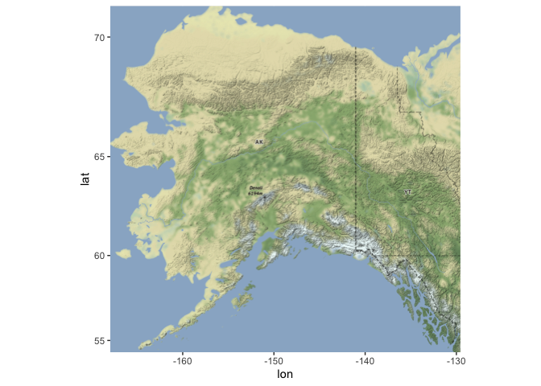<!-- -->

Build a final map that overlays the recorded observations of grizzly bears in Alaska.

```r
ggmap(map_projection) + geom_point(data = grizzly, aes(longitude,latitude), size=1, color = "blue") + labs(x = "Longitude", y= "Latitude", title = "Recorded Observations of Grizzly Bears in Alaska")
```

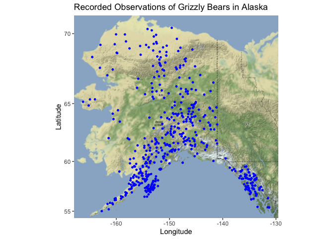<!-- -->

Exercise 2: Wolves data. Load the data and evaluate its structure.

```r
wolves <- readr::read_csv("data/wolves_data/wolves_dataset.csv")
```

```
## Parsed with column specification:
## cols(
##   .default = col_double(),
##   pop = col_character(),
##   age.cat = col_character(),
##   sex = col_character(),
##   color = col_character()
## )
```

```
## See spec(...) for full column specifications.
```

```r
str(wolves)
```

```
## tibble [1,986 × 23] (S3: spec_tbl_df/tbl_df/tbl/data.frame)
##  $ pop               : chr [1:1986] "AK.PEN" "AK.PEN" "AK.PEN" "AK.PEN" ...
##  $ year              : num [1:1986] 2006 2006 2006 2006 2006 ...
##  $ age.cat           : chr [1:1986] "S" "S" "A" "S" ...
##  $ sex               : chr [1:1986] "F" "M" "F" "M" ...
##  $ color             : chr [1:1986] "G" "G" "G" "B" ...
##  $ lat               : num [1:1986] 57 57 57 57 57 ...
##  $ long              : num [1:1986] -158 -158 -158 -158 -158 ...
##  $ habitat           : num [1:1986] 254 254 254 254 254 ...
##  $ human             : num [1:1986] 10.4 10.4 10.4 10.4 10.4 ...
##  $ pop.density       : num [1:1986] 8 8 8 8 8 8 8 8 8 8 ...
##  $ pack.size         : num [1:1986] 8.78 8.78 8.78 8.78 8.78 8.78 8.78 8.78 8.78 8.78 ...
##  $ standard.habitat  : num [1:1986] -1.63 -1.63 -1.63 -1.63 -1.63 ...
##  $ standard.human    : num [1:1986] -0.978 -0.978 -0.978 -0.978 -0.978 ...
##  $ standard.pop      : num [1:1986] -0.683 -0.683 -0.683 -0.683 -0.683 ...
##  $ standard.packsize : num [1:1986] 1.32 1.32 1.32 1.32 1.32 ...
##  $ standard.latitude : num [1:1986] 0.721 0.721 0.721 0.721 0.721 ...
##  $ standard.longitude: num [1:1986] -2.14 -2.14 -2.14 -2.14 -2.14 ...
##  $ cav.binary        : num [1:1986] 1 1 1 0 1 1 1 1 1 1 ...
##  $ cdv.binary        : num [1:1986] 0 0 0 0 0 1 0 0 0 0 ...
##  $ cpv.binary        : num [1:1986] 0 0 1 1 0 1 0 0 0 0 ...
##  $ chv.binary        : num [1:1986] 1 1 1 1 1 1 1 1 1 0 ...
##  $ neo.binary        : num [1:1986] NA NA NA 0 0 NA NA 1 0 1 ...
##  $ toxo.binary       : num [1:1986] NA NA NA 1 0 NA NA 1 0 0 ...
##  - attr(*, "spec")=
##   .. cols(
##   ..   pop = col_character(),
##   ..   year = col_double(),
##   ..   age.cat = col_character(),
##   ..   sex = col_character(),
##   ..   color = col_character(),
##   ..   lat = col_double(),
##   ..   long = col_double(),
##   ..   habitat = col_double(),
##   ..   human = col_double(),
##   ..   pop.density = col_double(),
##   ..   pack.size = col_double(),
##   ..   standard.habitat = col_double(),
##   ..   standard.human = col_double(),
##   ..   standard.pop = col_double(),
##   ..   standard.packsize = col_double(),
##   ..   standard.latitude = col_double(),
##   ..   standard.longitude = col_double(),
##   ..   cav.binary = col_double(),
##   ..   cdv.binary = col_double(),
##   ..   cpv.binary = col_double(),
##   ..   chv.binary = col_double(),
##   ..   neo.binary = col_double(),
##   ..   toxo.binary = col_double()
##   .. )
```

```r
skim(wolves)
```


Table: Data summary

|                         |       |
|:------------------------|:------|
|Name                     |wolves |
|Number of rows           |1986   |
|Number of columns        |23     |
|_______________________  |       |
|Column type frequency:   |       |
|character                |4      |
|numeric                  |19     |
|________________________ |       |
|Group variables          |None   |


**Variable type: character**

|skim_variable | n_missing| complete_rate| min| max| empty| n_unique| whitespace|
|:-------------|---------:|-------------:|---:|---:|-----:|--------:|----------:|
|pop           |         0|          1.00|   2|   7|     0|       17|          0|
|age.cat       |       102|          0.95|   1|   1|     0|        3|          0|
|sex           |        19|          0.99|   1|   1|     0|        2|          0|
|color         |       616|          0.69|   1|   1|     0|        2|          0|


**Variable type: numeric**

|skim_variable      | n_missing| complete_rate|     mean|      sd|      p0|      p25|      p50|      p75|     p100|hist  |
|:------------------|---------:|-------------:|--------:|-------:|-------:|--------:|--------:|--------:|--------:|:-----|
|year               |         0|          1.00|  2010.28|    5.91| 1992.00|  2006.00|  2011.00|  2016.00|  2019.00|▁▂▆▆▇ |
|lat                |         0|          1.00|    50.43|    9.16|   33.89|    44.60|    46.83|    57.89|    80.50|▁▇▂▂▁ |
|long               |         0|          1.00|  -116.86|   19.11| -157.84|  -123.73|  -110.99|  -110.55|   -82.42|▃▁▂▇▂ |
|habitat            |         0|          1.00| 12797.42| 7330.64|  254.08| 10375.16| 11211.30| 11860.81| 34676.55|▂▇▂▁▁ |
|human              |         0|          1.00|  2335.38| 1912.21|    0.02|    80.60|  2787.67|  3973.47|  6228.64|▇▁▅▅▁ |
|pop.density        |         0|          1.00|    14.91|    9.50|    3.74|     7.40|    11.63|    25.32|    33.96|▇▅▁▂▅ |
|pack.size          |         0|          1.00|     6.47|    1.67|    3.55|     5.62|     6.37|     8.25|     9.56|▅▇▅▆▃ |
|standard.habitat   |         0|          1.00|     0.01|    0.96|   -1.63|    -0.31|    -0.20|    -0.11|     2.88|▂▇▂▁▁ |
|standard.human     |         0|          1.00|     0.15|    0.92|   -0.98|    -0.94|     0.36|     0.94|     2.03|▇▁▅▅▁ |
|standard.pop       |         0|          1.00|     0.05|    1.01|   -1.13|    -0.75|    -0.30|     1.15|     2.07|▇▅▁▂▅ |
|standard.packsize  |         0|          1.00|    -0.04|    0.98|   -1.76|    -0.54|    -0.10|     1.00|     1.77|▅▇▅▆▃ |
|standard.latitude  |         0|          1.00|     0.00|    1.00|   -1.81|    -0.64|    -0.39|     0.81|     3.28|▁▇▂▂▁ |
|standard.longitude |         0|          1.00|     0.00|    1.00|   -2.14|    -0.36|     0.31|     0.33|     1.80|▃▁▂▇▂ |
|cav.binary         |       321|          0.84|     0.85|    0.35|    0.00|     1.00|     1.00|     1.00|     1.00|▂▁▁▁▇ |
|cdv.binary         |        21|          0.99|     0.22|    0.42|    0.00|     0.00|     0.00|     0.00|     1.00|▇▁▁▁▂ |
|cpv.binary         |         7|          1.00|     0.79|    0.40|    0.00|     1.00|     1.00|     1.00|     1.00|▂▁▁▁▇ |
|chv.binary         |       548|          0.72|     0.80|    0.40|    0.00|     1.00|     1.00|     1.00|     1.00|▂▁▁▁▇ |
|neo.binary         |       538|          0.73|     0.28|    0.45|    0.00|     0.00|     0.00|     1.00|     1.00|▇▁▁▁▃ |
|toxo.binary        |       827|          0.58|     0.48|    0.50|    0.00|     0.00|     0.00|     1.00|     1.00|▇▁▁▁▇ |

```r
str(wolves)
```

```
## tibble [1,986 × 23] (S3: spec_tbl_df/tbl_df/tbl/data.frame)
##  $ pop               : chr [1:1986] "AK.PEN" "AK.PEN" "AK.PEN" "AK.PEN" ...
##  $ year              : num [1:1986] 2006 2006 2006 2006 2006 ...
##  $ age.cat           : chr [1:1986] "S" "S" "A" "S" ...
##  $ sex               : chr [1:1986] "F" "M" "F" "M" ...
##  $ color             : chr [1:1986] "G" "G" "G" "B" ...
##  $ lat               : num [1:1986] 57 57 57 57 57 ...
##  $ long              : num [1:1986] -158 -158 -158 -158 -158 ...
##  $ habitat           : num [1:1986] 254 254 254 254 254 ...
##  $ human             : num [1:1986] 10.4 10.4 10.4 10.4 10.4 ...
##  $ pop.density       : num [1:1986] 8 8 8 8 8 8 8 8 8 8 ...
##  $ pack.size         : num [1:1986] 8.78 8.78 8.78 8.78 8.78 8.78 8.78 8.78 8.78 8.78 ...
##  $ standard.habitat  : num [1:1986] -1.63 -1.63 -1.63 -1.63 -1.63 ...
##  $ standard.human    : num [1:1986] -0.978 -0.978 -0.978 -0.978 -0.978 ...
##  $ standard.pop      : num [1:1986] -0.683 -0.683 -0.683 -0.683 -0.683 ...
##  $ standard.packsize : num [1:1986] 1.32 1.32 1.32 1.32 1.32 ...
##  $ standard.latitude : num [1:1986] 0.721 0.721 0.721 0.721 0.721 ...
##  $ standard.longitude: num [1:1986] -2.14 -2.14 -2.14 -2.14 -2.14 ...
##  $ cav.binary        : num [1:1986] 1 1 1 0 1 1 1 1 1 1 ...
##  $ cdv.binary        : num [1:1986] 0 0 0 0 0 1 0 0 0 0 ...
##  $ cpv.binary        : num [1:1986] 0 0 1 1 0 1 0 0 0 0 ...
##  $ chv.binary        : num [1:1986] 1 1 1 1 1 1 1 1 1 0 ...
##  $ neo.binary        : num [1:1986] NA NA NA 0 0 NA NA 1 0 1 ...
##  $ toxo.binary       : num [1:1986] NA NA NA 1 0 NA NA 1 0 0 ...
##  - attr(*, "spec")=
##   .. cols(
##   ..   pop = col_character(),
##   ..   year = col_double(),
##   ..   age.cat = col_character(),
##   ..   sex = col_character(),
##   ..   color = col_character(),
##   ..   lat = col_double(),
##   ..   long = col_double(),
##   ..   habitat = col_double(),
##   ..   human = col_double(),
##   ..   pop.density = col_double(),
##   ..   pack.size = col_double(),
##   ..   standard.habitat = col_double(),
##   ..   standard.human = col_double(),
##   ..   standard.pop = col_double(),
##   ..   standard.packsize = col_double(),
##   ..   standard.latitude = col_double(),
##   ..   standard.longitude = col_double(),
##   ..   cav.binary = col_double(),
##   ..   cdv.binary = col_double(),
##   ..   cpv.binary = col_double(),
##   ..   chv.binary = col_double(),
##   ..   neo.binary = col_double(),
##   ..   toxo.binary = col_double()
##   .. )
```

Evaluating how many distinct wolf populations are included in this study:

```r
wolves$pop <- as.factor(wolves$pop)
n_distinct(wolves$pop)
```

```
## [1] 17
```


```r
wolves_US <- wolves %>%
  filter(lat<=48)
wolves_US
```

```
## # A tibble: 1,169 x 23
##    pop    year age.cat sex   color   lat  long habitat human pop.density
##    <fct> <dbl> <chr>   <chr> <chr> <dbl> <dbl>   <dbl> <dbl>       <dbl>
##  1 GTNP   2012 P       M     G      43.8 -111.  10375. 3924.        34.0
##  2 GTNP   2012 P       F     G      43.8 -111.  10375. 3924.        34.0
##  3 GTNP   2012 P       F     G      43.8 -111.  10375. 3924.        34.0
##  4 GTNP   2012 P       M     B      43.8 -111.  10375. 3924.        34.0
##  5 GTNP   2013 A       F     G      43.8 -111.  10375. 3924.        34.0
##  6 GTNP   2013 A       M     G      43.8 -111.  10375. 3924.        34.0
##  7 GTNP   2013 P       M     G      43.8 -111.  10375. 3924.        34.0
##  8 GTNP   2013 P       M     G      43.8 -111.  10375. 3924.        34.0
##  9 GTNP   2013 P       M     G      43.8 -111.  10375. 3924.        34.0
## 10 GTNP   2013 P       F     G      43.8 -111.  10375. 3924.        34.0
## # … with 1,159 more rows, and 13 more variables: pack.size <dbl>,
## #   standard.habitat <dbl>, standard.human <dbl>, standard.pop <dbl>,
## #   standard.packsize <dbl>, standard.latitude <dbl>, standard.longitude <dbl>,
## #   cav.binary <dbl>, cdv.binary <dbl>, cpv.binary <dbl>, chv.binary <dbl>,
## #   neo.binary <dbl>, toxo.binary <dbl>
```

Use the `albersusa` package to make a base map of the lower 48 US states.

```r
us_lower <- usa_sf()
```


```r
c_comp <- counties_sf()
```


```r
ggplot() +
  geom_sf(data=us_lower, size = 0.25) + theme_linedraw() + labs(title = "US State Boundaries")
```

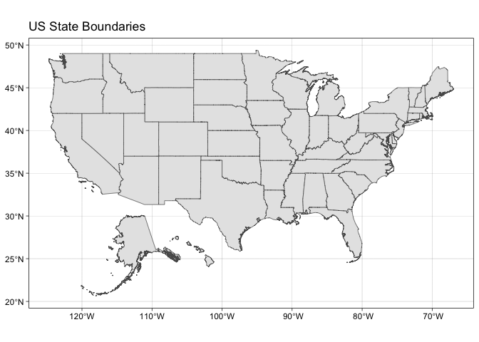<!-- -->

Use the relimited data to plot the distribution of wolf populations in the lower 48 US states.


```r
ggplot() + 
  geom_sf(data = us_lower, size = 0.125) + 
  theme_linedraw()+
  geom_point(data = wolves_US, aes(long, lat, color=pop), shape=2, size=4)+
  labs(title = "Distribution of Wolf Species",
       x = "Longitude",
       y = "Latitude")+
  theme_minimal()
```

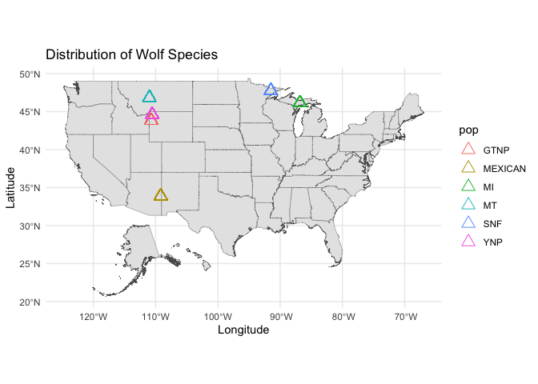<!-- -->


Average pack size for the wolves in this study by region:

```r
wolves %>%
  group_by(pop) %>%
  summarize(avg_wolfpacksize = mean(pack.size), .groups='keep') %>%
  arrange(desc(avg_wolfpacksize))
```

```
## # A tibble: 17 x 2
## # Groups:   pop [17]
##    pop     avg_wolfpacksize
##    <fct>              <dbl>
##  1 BAN.JAS             9.56
##  2 ELLES               9.19
##  3 AK.PEN              8.78
##  4 YNP                 8.25
##  5 GTNP                8.1 
##  6 MI                  7.12
##  7 DENALI              6.45
##  8 YUCH                6.37
##  9 INT.AK              6.24
## 10 BC                  5.88
## 11 MT                  5.62
## 12 SE.AK               5   
## 13 SNF                 4.81
## 14 ONT                 4.37
## 15 MEXICAN             4.04
## 16 N.NWT               4   
## 17 SS.NWT              3.55
```

Make a new map that shows the distribution of wolves in the lower 48 US states but which has the size of location markers adjusted by pack size.

```r
wolfplot <- ggplot() +
  geom_sf(data=us_lower, size=0.2) + 
  geom_point(data=wolves_US, aes(long,lat,size=pack.size,color=pack.size), shape=5) + theme_minimal()+
  labs(title = "Distribution of Wolves in Lower 48 US states by Pack Size", x = "Longitude", y="Latitude")

  # devtools::install_github('rOpenSci/gistr')
  # animint2gist(animint(wolfplot))   # Applies animint to wolfplot, opens link to bl.ocks.org.
  wolfplot
```

<!-- -->


